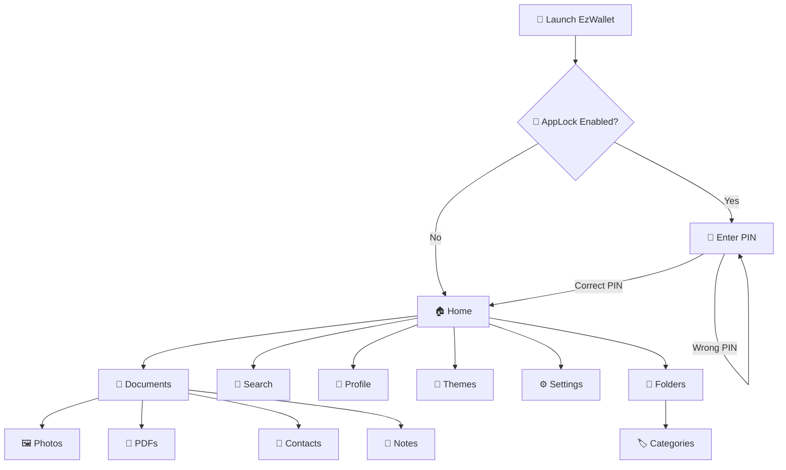

# 💰 EzWallet

<p align="center">
  
</p>

<p align="center">
  
  
  
</p>

<p align="center">
  <strong>🔐 Secure your important information. 📂 Organize everything. 🎨 Make it yours.</strong>
</p>

---

## 🌟 About EzWallet

**EzWallet** is a modern Android application designed to keep your important digital information organized, accessible, and protected in one place.

From **Photos and PDFs** to **Contacts and secure Notes**, EzWallet provides a simple way to manage your personal documents while giving you complete control over organization, appearance, and security.

> 💡 **One app. Everything organized. Completely yours.**

---

## ✨ Key Features

<table>
<tr>
<td width="50%">

### 📂 Document Management

Import and organize:

* 🖼️ JPG & PNG Photos
* 📄 PDF Documents
* 👤 Contact Cards
* 📝 Secure Text Notes

</td>

<td width="50%">

### 🔎 Universal Search

Search across your entire collection using:

* Document titles
* Details
* Categories
* Contact names
* Folder groups

Search is **case-insensitive** for a smoother experience.

</td>
</tr>

<tr>
<td>

### 🔐 AppLock Security

Protect your information with:

* 🔢 4-digit PIN
* 🔒 App entry protection
* 🗑️ Delete verification
* 🛡️ Extra protection for sensitive data

</td>

<td>

### 🗂️ Smart Organization

Keep everything structured with:

* 📁 Custom folders
* 🏷️ Categories
* 🔄 Sorting options
* ⚡ Custom ordering

</td>
</tr>

<tr>
<td>

### 🎨 Custom Themes

Personalize the interface with:

* 🌈 Background Color
* 🎯 Primary/Selection Color
* 🗃️ File/Card Color
* 🌙 Dark Mode
* ☀️ Light Mode

</td>

<td>

### 🖼️ Multiple View Modes

Choose how your documents appear:

* 📋 Standard Bars
* 🔲 Grid Boxes
* ➡️ Horizontal Cards

</td>
</tr>
</table>

---

## 👤 Personal Profile

EzWallet also provides a dedicated personal profile section where users can keep important personal information readily accessible.

```text
👤 Full Name
🎂 Age
📅 Date of Birth
📞 Phone Number
📧 Email
🏠 Address
```

---

## 🚀 Why EzWallet?

```text
                 ┌─────────────────────────┐
                 │        💰 EzWallet       │
                 └────────────┬────────────┘
                              │
          ┌───────────────────┼───────────────────┐
          │                   │                   │
       🔐 SECURITY         📂 ORGANIZATION      🎨 CUSTOM
          │                   │                   │
      AppLock PIN         Smart Folders       Themes
      Secure Delete       Categories          Colors
          │                   │                   │
          └───────────────────┼───────────────────┘
                              │
                       📱 EASY ACCESS
```

EzWallet focuses on three core principles:

**🔐 Security** — Keep sensitive information protected.

**📂 Organization** — Find your files quickly.

**🎨 Personalization** — Make the app feel like your own.

---

## 🛠️ Tech Stack

<p align="center">


</p>

### Core Technologies

| Technology            | Purpose                       |
| --------------------- | ----------------------------- |
| 🟣 **Kotlin**         | Application development       |
| 🟢 **Android Studio** | Development environment       |
| ⚙️ **Gradle**         | Build & dependency management |
| 🐙 **Git & GitHub**   | Version control               |
| 📱 **Android SDK**    | Android application platform  |

---

## 📱 Application Flow



---

## 📸 Screenshots

<p align="center">

<!-- Add your screenshots here -->


</p>

<p align="center">
  <i>More screenshots coming soon...</i>
</p>

---

## 🎨 Customization

EzWallet gives users control over the application's visual appearance.

```text
🎨 Background Color
        ↓
🎯 Primary Color
        ↓
🗃️ Card/File Color
        ↓
🌙 Dark / ☀️ Light Mode
        ↓
✨ Your Personal EzWallet
```

---

## 🔎 Search Experience

Finding information should be simple.

EzWallet's search system can search through:

```text
📄 Document Title
       ↓
📝 Details
       ↓
🏷️ Category
       ↓
👤 Contact Name
       ↓
📁 Folder
```

This makes it easy to locate information even when you have a large collection of documents.

---

## 🔐 Security

Security is one of the core concepts behind EzWallet.

### AppLock

Users can configure a **4-digit PIN** to protect the application.

```text
        🔐 EzWallet
             │
             ▼
       ┌─────────────┐
       │  Enter PIN  │
       └──────┬──────┘
              │
       ┌──────▼──────┐
       │ Verification│
       └──────┬──────┘
              │
       ┌──────▼──────┐
       │ 🏠 Access   │
       └─────────────┘
```

Sensitive actions such as deleting documents can also require PIN verification.

---

## 🔮 Future Improvements

EzWallet is continuously evolving 🚀

Possible future features:

* ☁️ Cloud Backup
* 🔄 Data Synchronization
* 🔑 Biometric Authentication
* 📤 Secure File Sharing
* 🏷️ Advanced Tagging
* 📊 Storage Analytics
* 🔔 Smart Reminders
* 🌐 Multi-device Sync
* 🤖 AI-powered document organization

---

## 🧑‍💻 Developer

<p align="center">

### 👨‍💻 Abhirup Das

**B.Tech Computer Science Engineering Student**

Passionate about:

`Android Development` • `Full Stack Development` • `Artificial Intelligence` • `Problem Solving`

</p>

---

## ⭐ Support

If you like **EzWallet**, consider giving the repository a ⭐.

It helps support the project and motivates further development! ❤️

<p align="center">

⭐ **Star this repository** ⭐

</p>

---

<p align="center">
  
</p>

<p align="center">
  💰 <b>EzWallet</b> — Secure • Organized • Yours
</p>
